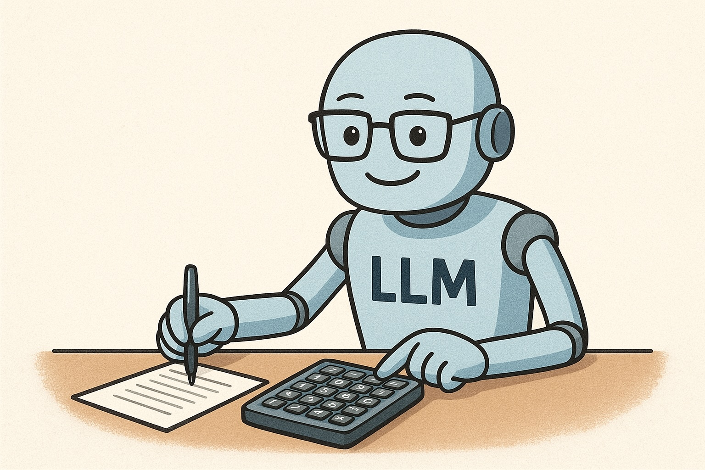
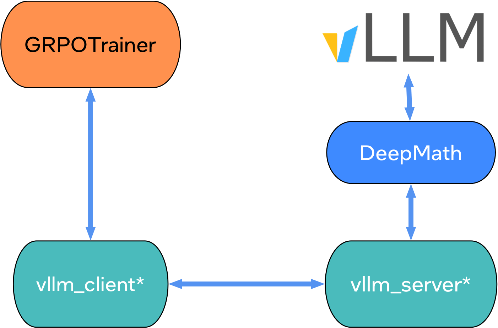

# DeepMath: A Lightweight Math Reasoning Agent for LLMs

<div align="center">

</div>

Large language models (LLMs) have made impressive strides in reasoning tasks, yet mathematical problem-solving remains a challenge. Traditional "chain-of-thought" reasoning often produces verbose explanations and error-prone arithmetic. **DeepMath** tackles this by combining a small Python executor with a fine-tuned LLM, enabling concise, computation-driven reasoning.


## DeepMath

DeepMath is built on **Qwen3-4B Thinking** and fine-tuned with **GRPO (Group Relative Policy Optimization)**. Instead of verbose text, the model emits **tiny Python snippets** for intermediate steps, runs them in a secure sandbox, and folds the results back into its reasoning, reducing errors and output length.

✅ No file I/O, no network calls, strict timeouts.

✅ Safe, deterministic, and auditable.

We evaluate DeepMath on four math datasets: **MATH500, AIME, HMMT, and HLE,** and show that:

- The math agent alone improves accuracy and reduces verbosity.

- GRPO training alone biases outputs toward brevity and correctness.

- Combining the agent with GRPO yields the largest gains.

Check out:

- 🔗 Blog: https://huggingface.co/blog/intel-deepmath 

- 👉 Model: <https://huggingface.co/Intel/deepmath-v1>

## Why DeepMath?

LLMs often struggle with numeric precision and produce unnecessarily long reasoning chains. Two opportunities stand out:

1. **Offload deterministic computation** to a safe executor.

2. **Train models to prefer concise, computation-oriented traces** over verbose text.

DeepMath implements both. The model learns to generate short Python snippets, which are executed in a sandbox and reintegrated into the context. GRPO fine-tuning encourages this behavior by rewarding correctness and encouraging shorter outputs.

## How It Works

- Base model: [Qwen3-4B Thinking](https://huggingface.co/Qwen/Qwen3-4B-Thinking-2507).
- Executor constraints: sandboxed environment, allow-list of imported modules, per-snippet timeout.
- Inference: based on [SmolAgents](https://github.com/huggingface/smolagents/), a math agent was created. vLLM is used as the inference engine.
- Training: based on the GRPO trainer in [TRL](https://github.com/huggingface/trl), we modified TRL's vLLM client and server to generate GRPO completions using our DeepMath agent.

<div align="center">
<figure>

<figcaption><p>Figure 1: The vLLM client and server were modified to use the DeepMath agent in generating the candidates, while using the vLLM backend.</p></figcaption>
</figure>
</div>

- **Agent Interface:** During inference, the model can output normal tokens or special agent calls containing Python snippets.

- **Execution:** Snippets run in a sandboxed environment with strict safety constraints (no file I/O, no network, timeouts).

- **Design Goals:**

  - **Concision:** Replace multi-line textual calculations with short, focused snippets.

  - **Determinism & Safety:** Enforce strict execution limits.

  - **Interpretability:** Snippets are readable and auditable.

<div align="center">
<figure>

<figcaption><p>Figure 2: Output example where python code is generated, evaluated and the answer is inserted into the trace and used for context.</p></figcaption>
</figure>
</div>

## Training with GRPO

We fine-tune the model using **GRPO**, a reward-based optimization that balances:

- **Accuracy Reward:** +1 for correct answers.

- **Using code snippets:** +1 for generating code snippets, weighted 10:1 vs. the accuracy reward.

- **Length reduction:** shorter lengths are encouraged by limiting the GRPO completion candidates to 5k tokens.

- **Temperature Scheduling:** We implemented linear temperature scheduling (T=1.2 → T=0.7) to balance exploration and stability during training. This approach aims to enhance experimentation during the initial training phases, subsequently reducing the temperature as we refine our proficiency in the skill.

- **In-context Learning**: we include 4 solved examples where the trace contains agent calls and executor outputs, so the model learns the syntax and the call/response pattern.

- **Dataset**: we used [OpenMathReasoning](https://huggingface.co/datasets/nvidia/OpenMathReasoning) dataset, the tool-usage subset. Note that GRPO only uses the <u>problem</u>, not the solution in the data. Choosing this dataset ensures problems benefit form tool use.

## Evaluation

We benchmarked DeepMath against baselines on four datasets. Metrics include:

- **majority@16** (robustness across samples).

- **Mean output length** (brevity).

<div align="center">

</div>

**Key Insight:** DeepMath reduces output length by up to **66%** while improving accuracy on challenging datasets.

## Why It Matters

- **Accuracy:** Offloading computation reduces arithmetic errors.

- **Efficiency:** Shorter outputs mean faster inference and easier interpretability.

- **Safety:** Sandbox execution mitigates risks of running arbitrary code.

## Conclusion

DeepMath demonstrates a practical and lightweight way to combine a small executor with an LLM and to train the model to prefer short, computation-driven traces. Offloading deterministic computation reduces arithmetic and numerical errors and shortens traces, and GRPO fine-tuning further encourages concise, correct answers. The result is a more accurate and more interpretable math-solving agent without requiring a massive model or heavyweight external tools.

## Try It Yourself

Check out the GitHub repo and share your feedback! Contributions welcome. 🚀

## Installation

DeepMath uses [uv](https://github.com/astral-sh/uv):

1. **Install uv** (if not already installed):

```bash
curl -LsSf https://astral.sh/uv/install.sh | sh
```

2. **Clone the repository**:

```bash
git clone https://github.com/intellabs/DeepMath.git
cd DeepMath
```

3. **Install dependencies**:

```bash
uv pip install -r requirements.txt
uv pip install -e .
```

## Usage

The `example.sh` script provides complete examples for training, inference, and evaluation. Below are the main workflows:

### Training

Training involves two components running in parallel:

1. **Start the vLLM server** (for generating completions during GRPO training):

```bash
CUDA_VISIBLE_DEVICES=0,1,2,3,4,5 \
    python -m deep_math.vllm_serve_agent \
    --model Qwen/Qwen3-4B-Thinking-2507 \
    --tensor_parallel_size 1 \
    --data_parallel_size 6 \
    --config configs/vllm_agent_server_4B.yaml \
    --max_steps 50 \
    --max_agent_output 5000
```

2. **Run the GRPO trainer**:

```bash
CUDA_VISIBLE_DEVICES=6,7 \
    accelerate launch --config_file configs/zero2.yaml \
    --num_processes 2 \
    training.py
```

### Inference

Run inference with different configurations. Examples use the MATH500 dataset:

**Baseline (no agent, no fine-tuning)**:

```bash
python inference.py \
    +model.use_vllm=true \
    model.generation.max_new_tokens=20000 \
    model.generation.do_sample=true \
    model.generation.temperature=0.6 \
    model.model_name_or_path=Qwen/Qwen3-4B-Thinking-2507 \
    hf_tag=HuggingFaceH4/MATH-500 \
    generated_file=baseline-MATH500.jsonl
```

**With agent** (adds Python code execution):

```bash
python inference.py \
    +model.use_vllm=true \
    +model.math_agent=true \
    +model.examples=deep_math/fewshot.txt \
    model.generation.max_new_tokens=3000
    +model.max_agent_output=20000 \
    +model.max_steps=50 \
    model.model_name_or_path=Qwen/Qwen3-4B-Thinking-2507 \
    hf_tag=HuggingFaceH4/MATH-500 \
    generated_file=agent-MATH500.jsonl
```

**With fine-tuned LoRA adapter**:

```bash
python inference.py \
    +model.use_vllm=true \
    +model.math_agent=true \
    model.lora_path=/PATH/TO/CHECKPOINT \
    +model.vllm_params.max_lora_rank=32 \
    model.generation.max_new_tokens=3000
    +model.max_agent_output=20000 \
    +model.max_steps=50 \
    model.model_name_or_path=Qwen/Qwen3-4B-Thinking-2507 \
    hf_tag=HuggingFaceH4/MATH-500 \
    generated_file=trained-agent-MATH500.jsonl
```

### Evaluation

Compare multiple inference runs:

```bash
python evaluation.py \
    generated_file=baseline-MATH500.jsonl,agent-MATH500.jsonl,trained-agent-MATH500.jsonl
```

See `example.sh` for complete command examples with all parameters.

## Citation

If you use DeepMath in your research, please cite:

```bibtex
@software{deepmath2025,
  author = {Fleischer, Daniel and Berchansky, Moshe and Wasserblat, Moshe},
  title = {DeepMath: A Lightweight Math Reasoning Agent for LLMs},
  year = {2025},
  publisher = {Intel AI Labs},
  url = {https://github.com/IntelLabs/DeepMath}
}
```

## Limitations & Future Work

- **Scope**: we focused on a small model and on mathematical reasoning.

- **Generalization**: evaluated on contest-style math; results may not transfer to open-ended mathematical creativity or formal proofs.

- Executing generated code is inherently risky. DeepMath uses strict sandboxing and resource limits, but any deployment should carefully manage attack surfaces and enforce rate limits.
